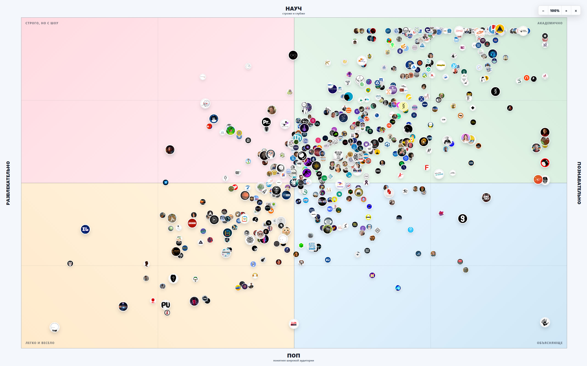

# Научпоп компасс

Шуточная карта научно-популярных YouTube-каналов в духе политического компаса, но без политики.

Оси сравнивают не качество каналов и не то, кто «научнее» в абсолютном смысле, а стиль подачи:

- сверху — строже и глубже;
- снизу — понятнее широкой аудитории;
- слева — более развлекательно;
- справа — более познавательно.

Это юмористическая визуализация, а не рейтинг, не экспертный вердикт и не попытка исключить кого-то из «настоящей науки». Раскладка может быть неточной: она строится автоматически по доступным данным и экспериментальным правилам.

Оригинальная интерактивная версия: https://scitopus.com/compass
